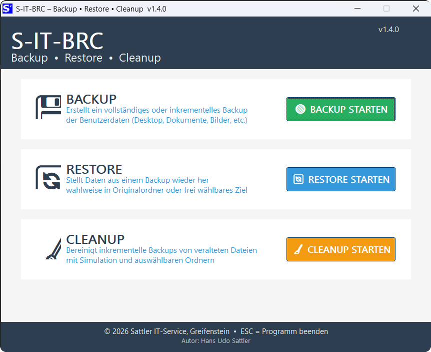

# S-IT-BRC

**Professionelles Backup-, Restore- und Cleanup-Tool für Windows**

Benutzerdaten sichern, wiederherstellen und Backups bereinigen –
drei Module in einem einheitlichen Programm mit Setup und Deinstaller.

---

---

## Module

- 💾 **Backup** – Sichert Desktop, Dokumente, Bilder, Musik, Videos, Downloads und AppData auf ein externes Laufwerk – inkrementell oder als vollständiges Archiv
- 🔄 **Restore** – Stellt Daten aus einem Backup wieder her – in die Originalordner, ein frei wählbares Zielverzeichnis oder auf einen anderen PC
- 🧹 **Cleanup** – Bereinigt inkrementelle Backups von veralteten Dateien; Simulation vor dem echten Lauf möglich; gelöschte Dateien werden sicher in einen Archivordner verschoben
- 📋 **Log & Protokoll** – Alle Vorgänge werden protokolliert; Log-Dateien direkt aus dem Programm abrufbar

## Download

➡️ **[Aktuelle Version herunterladen](https://github.com/SattlerIT/sit-brc/releases)**

Setup ausführen – Verknüpfungen, Startmenü-Eintrag und Eintrag in Windows Programme & Features werden automatisch angelegt. Portabel-Modus für USB-Sticks ebenfalls verfügbar.

## Systemanforderungen

- Windows 10 / Windows 11 (64-Bit)
- Administratorrechte werden beim Programmstart automatisch angefordert
- Lieferumfang: Setup, Deinstaller und Hilfe-Dateien für alle drei Module

## Weitere Informationen

📄 **[Zur Projektseite](https://sattlerit.github.io/sit-brc/)**

## Sicherheitshinweis

Windows SmartScreen oder Virenscanner können die EXE beim ersten Start als unbekannt einstufen.
Bitte als vertrauenswürdig bzw. Ausnahme hinzufügen.
Alle Dateien stammen ausschließlich von **Sattler IT-Service** über diese GitHub-Seite.

## Spende / Donate

Die S-IT-Tools werden kostenlos entwickelt und gepflegt.
Eine kleine Spende hilft dabei, die Entwicklung fortzuführen – herzlichen Dank! 🙏

---

© 2026 Hans Udo Sattler · Sattler IT-Service, Greifenstein
